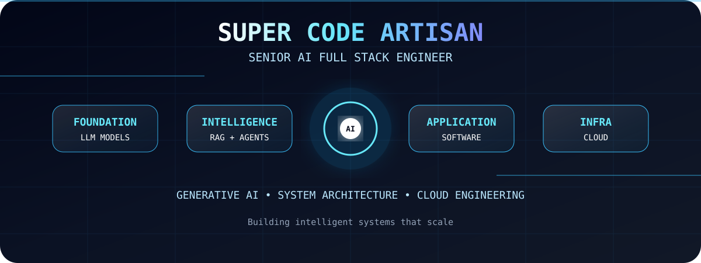

## About Me

I'm a Senior AI Full Stack Engineer with **8+ years** of experience designing and shipping AI-powered applications, enterprise platforms, and cloud-native SaaS products across healthcare, fintech, e-commerce, and mobility.

My focus is on combining **Generative AI / LLMs** with production-grade full-stack engineering — turning RAG pipelines, AI copilots, and knowledge platforms into real software that enterprise teams actually use every day. I'm equally comfortable architecting a microservices backend as I am tuning a retrieval pipeline or shipping the React front end on top of it.
# ⚔️ All Of My Skills

<table>
<tr>
<td align="center" width="110">
 TypeScript
</td>
<td align="center" width="110">
 JavaScript
</td>
<td align="center" width="110">
 React
</td>
<td align="center" width="110">
 Next.js
</td>
<td align="center" width="110">
 Vue
</td>
<td align="center" width="110">
 Nuxt.js
</td>
<td align="center" width="110">
 Angular
</td>
<td align="center" width="110">
 Svelte
</td>
</tr>

<tr>
<td align="center"> Redux</td>
<td align="center"> Tailwind CSS</td>
<td align="center"> Material UI</td>
<td align="center"> Bootstrap</td>
<td align="center"> Vite</td>
<td align="center"> Webpack</td>
<td align="center"> Rollup</td>
<td align="center"> Babel</td>
</tr>

<tr>
<td align="center"> Three.js</td>
<td align="center"> Jest</td>
<td align="center"> Vitest</td>
<td align="center"> Cypress</td>
<td align="center"> pnpm</td>
<td align="center"> Yarn</td>
<td align="center"> npm</td>
<td align="center"> Sass</td>
</tr>

<tr>
<td align="center"> Android Studio</td>
<td align="center"> Flutter</td>
<td align="center"> Node.js</td>
<td align="center"> Express</td>
<td align="center"> NestJS</td>
<td align="center"> Python</td>
<td align="center"> Django</td>
<td align="center"> FastAPI</td>
</tr>

<tr>
<td align="center"> Flask</td>
<td align="center"> Go</td>
<td align="center"> Spring</td>
<td align="center"> PHP</td>
<td align="center"> Laravel</td>
<td align="center"> Ruby</td>
<td align="center"> Rails</td>
<td align="center"> GraphQL</td>
</tr>

<tr>
<td align="center"> Prisma</td>
<td align="center"> PostgreSQL</td>
<td align="center"> MySQL</td>
<td align="center"> MongoDB</td>
<td align="center"> Redis</td>
<td align="center"> SQLite</td>
<td align="center"> Firebase</td>
<td align="center"> Supabase</td>
</tr>

<tr>
<td align="center"> Elasticsearch</td>
<td align="center"> AWS</td>
<td align="center"> GCP</td>
<td align="center"> Azure</td>
<td align="center"> Docker</td>
<td align="center"> Kubernetes</td>
<td align="center"> GitHub Actions</td>
<td align="center"> GitLab CI</td>
</tr>

<tr>
<td align="center"> Jenkins</td>
<td align="center"> Terraform</td>
<td align="center"> Ansible</td>
<td align="center"> NGINX</td>
<td align="center"> Cloudflare</td>
<td align="center"> Vercel</td>
<td align="center"> Netlify</td>
<td align="center"> Linux</td>
</tr>

<tr>
<td align="center"> Bash</td>
<td align="center"> .NET</td>
<td align="center"> TensorFlow</td>
<td align="center"> PyTorch</td>
<td align="center"> Java</td>
<td align="center"> Kotlin</td>
<td align="center"> Swift</td>
<td align="center"> Dart</td>
</tr>

</table>

